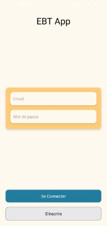
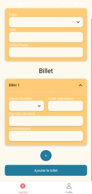
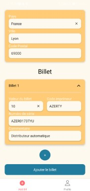
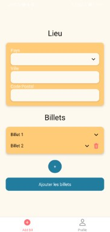
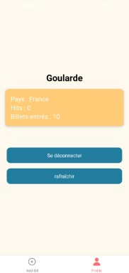

# EBT App

EBT App est une application mobile, facilitant l'enregistrement de billets pour le site [Euro Bill Better](https///eurobilltracker.com/).

Cette application n'est pour le moment pas disponible au téléchargement mais c'est en cours 🕒.

# Fonctionnalités
- ✅ Connexion et gestion des cookies de connexion
- ✅ Ajout d'un ou plusieurs billets
- ❌🕒 Lecture du code imprimeur et numéro de série avec l'appareil photo

# Technologies utilisées
  
<!--  -->
<!--  -->
<!--  -->
# L'application en image

## License

[MIT](/LICENSE)
